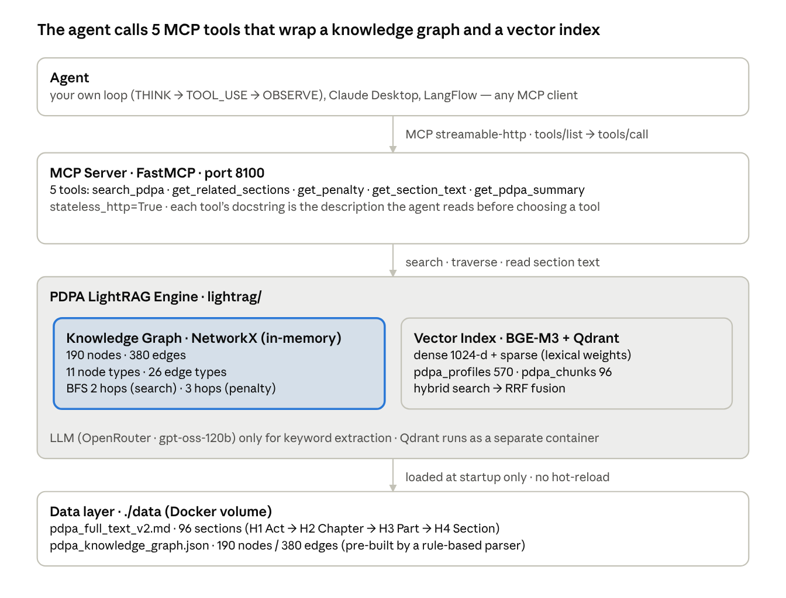
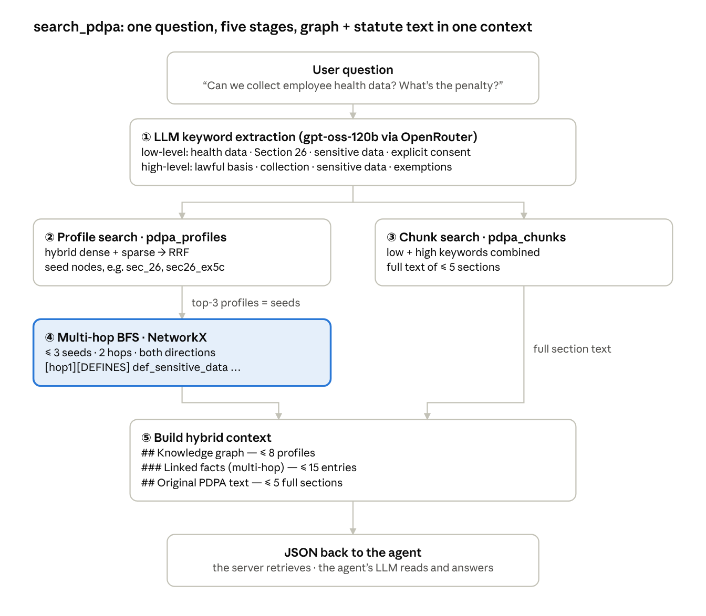

# PDPA GraphRAG + MCP

A GraphRAG agent over Thailand's Personal Data Protection Act (PDPA, B.E. 2562 / 2019).
The 96 sections of the statute become a 190-node / 380-edge knowledge graph plus a dense + sparse
vector index, exposed as five MCP tools that any agent can call. Everything runs locally with
Docker.

This is the companion code for the article series **"Why Vector RAG Answers Only Half of a Legal
Question"** (part 1 builds this system in five steps; parts 2 and 3 cover a graph bug and tool
design for agents). Statutes do not repeat themselves, they *point*: a prohibition lives in one
section, its exceptions in sub-clauses, and the penalty chapters later in a sentence that only says
"whoever violates Section 26". Vector search finds the first half; the graph walk finds the second.

The example is Thai law, but the structure is the same for GDPR, HIPAA, the CCPA or Japan's APPI,
and the embedding model is multilingual.

## What's inside

```
mcp_server_rag.py        FastMCP server (streamable-http, port 8100) exposing 5 tools
lightrag/                retrieval engine: Markdown chunker, NetworkX graph, BGE-M3 + Qdrant index, hybrid retrieval
data/
  pdpa_full_text_v2.md   the statute as Markdown (H1 Act -> H2 Chapter -> H3 Part -> H4 Section)
  pdpa_knowledge_graph.json   pre-built graph: 190 nodes / 380 edges, 11 node types, 26 edge types
scripts/
  build_graph.py         rule-based graph builder (sections + cross-references + curated nodes)
  validate_graph.py      counts nodes/edges from the data, checks connectivity and penalty reachability
labs/
  core/                  minimal MCP client (httpx), tool registry (MCP inputSchema -> OpenAI tools), LLM client
  lab7/agent_loop.py     the smallest possible agent loop, local tools only
  lab8/agent_pdpa_mcp.py the same loop wired to this MCP server (the run shown in the article)
examples/mcp_curl.sh     talk to the server with plain curl + jq
docs/                    architecture and pipeline figures
Dockerfile, docker-compose.yml, requirements.txt, .env.example
```

`labs/` contains only the agent-side code; the course lab instructions are not part of this repo.

## Architecture



- **Knowledge graph**: NetworkX, in memory. 96 Section nodes plus Definition, LawfulBasis, Right,
  Obligation, Penalty, Exemption and Principle nodes; the backbone edges are `REFERENCES_SECTION`
  (122, section cites section) and `CONTAINS_SECTION` (119).
- **Vector index**: BGE-M3 (dense 1024-d + sparse lexical weights) in Qdrant with RRF fusion.
  Two collections: `pdpa_chunks` (96 full sections) and `pdpa_profiles` (570 = every node and edge
  rendered as a short text, so vector search can land on graph nodes).
- **MCP server**: FastMCP, `stateless_http=True`. Each tool's docstring is the description the agent
  reads before choosing a tool.
- **LLM on the server side** is used for exactly one thing, extracting search keywords. Answers are
  written by the agent's own model: *the server retrieves, the agent reasons.*

## Quick start

Requirements: Docker with Compose, an [OpenRouter](https://openrouter.ai) API key, and about 5 GB of
disk for the image (BGE-M3, ~2.3 GB, is baked in at build time so the container starts offline).

```bash
cp .env.example .env            # put your OPENROUTER_API_KEY in .env
docker compose up --build       # starts Qdrant + the MCP server; the first build downloads BGE-M3
```

Startup is done when the log shows:

```
Parsed 96 sections (มาตรา), 96 chunks
Upserted 570 profile vectors
Upserted 96 chunk vectors
```

Smoke test with curl (needs `jq`):

```bash
./examples/mcp_curl.sh
```

A bare request without the `Accept: application/json, text/event-stream` header returns
`-32600 Client must accept text/event-stream`. That means the server is alive; the streamable-http
transport simply requires the header.

Run the agent against the server:

```bash
python -m venv .venv && source .venv/bin/activate
pip install -r requirements-agent.txt
python labs/lab8/agent_pdpa_mcp.py "เก็บข้อมูลสุขภาพพนักงานได้ไหม ถ้าฝ่าฝืนมีโทษอะไร"
```

The statute and the agent's system prompt are in Thai, so Thai questions work best (the model
answers in Thai; change `SYSTEM` in `labs/lab8/agent_pdpa_mcp.py` to answer in another language).
A typical run makes 7 tool calls in 4 rounds: `search_pdpa` -> `get_related_sections` +
`get_penalty` -> `get_section_text` x4 -> answer citing Sections 26 / 79 / 84.

## MCP tools

| Tool | What it does |
|---|---|
| `search_pdpa(query, top_k=5)` | Hybrid retrieval: LLM keywords -> profile search -> 2-hop BFS -> chunk search -> context (JSON) |
| `get_related_sections(section_id)` | In- and out-edges of one section, grouped by relationship |
| `get_penalty(section_id)` | BFS (max 3 hops) from the violated section to Penalty nodes. Pass the violated section (`sec_26`), not the penalty section |
| `get_section_text(section_id)` | Full statute text of one section by id, deterministic (no vector search) |
| `get_pdpa_summary()` | Node/edge counts and the schema of the graph |

Section ids are `sec_<number>` with Arabic digits (`sec_26`), even though the statute text uses Thai
numerals (มาตรา ๒๖).

## How retrieval works



1. An LLM splits the question into low-level keywords (section numbers, named rights, penalties) and
   high-level keywords (principles, concepts), after LightRAG's dual-level scheme.
2. Profile search (`pdpa_profiles`, dense + sparse, RRF) finds up to 3 seed nodes.
3. Chunk search (`pdpa_chunks`) fetches the full text of up to 5 sections.
4. BFS from the seeds, 2 hops, following edges in both directions; every reached node is written as
   `[hop1][GRANTS_EXEMPTION] sec26_ex5c: ...` so the model knows *why* it is there.
5. The context is capped (8 profiles, 15 expanded nodes, 5 full sections) and returned as JSON.
   The server never writes the answer.

## Rebuilding and validating the graph

```bash
python scripts/build_graph.py            # -> build/ (never overwrites data/)
python scripts/validate_graph.py         # checks data/pdpa_knowledge_graph.json
python scripts/validate_graph.py build/pdpa_knowledge_graph.json
```

`build_graph.py` is rule-based: a regex finds section headings in the Markdown, a second regex finds
cross-references inside each section (`REFERENCES_SECTION` edges), and the semantic nodes
(definitions, rights, obligations, penalties, exemptions, principles, lawful bases) are curated lists
inside the script. It reproduces the base graph (163 nodes / 345 edges). The shipped
`data/pdpa_knowledge_graph.json` is that base graph plus hand-added exemption nodes (190 / 380).
Its `metadata` block still reports the older 163 / 343 counts; always count from the data, which is
what `validate_graph.py` does.

To use this on another statute, swap the heading pattern (`Article\s+(\d+)` for GDPR,
`第([一二三四五六七八九十百]+)条` for Japan's APPI) and re-curate the semantic nodes.

## Known limitations

- Built for one statute. The graph lives in memory and both Qdrant collections are rebuilt on every
  start (no hot reload). For a corpus of laws use a graph database; `build_graph.py` also emits
  `pdpa_neo4j_import.cypher`.
- Rule-based graph construction means porting to a new law is curation work, not configuration.
- There is no formal evaluation set yet. Contributions of question/answer pairs with expected
  section citations are welcome.
- The shipped graph has a known gap that affects `get_penalty` for one section; it is the subject of
  part 2 of the article series and is left as is until that article is published.

## Data

The statute text is the Personal Data Protection Act B.E. 2562 (2019), a public document, prepared
from the version published by the Office of the Council of State of Thailand. The knowledge graph,
code and figures are by the author.

## Article series

1. Why Vector RAG Answers Only Half of a Legal Question (Thai: https://aekanunbigdata.medium.com/a0f1e09e3450 — English version coming)
2. One missing edge: why the agent cited the wrong penalty section (coming)
3. Why a GraphRAG agent needs a fifth tool (coming)
